<a id="readme-top"></a>

[![Contributors][contributors-shield]][contributors-url]
[![Forks][forks-shield]][forks-url]
[![Stargazers][stars-shield]][stars-url]
[![Issues][issues-shield]][issues-url]
[![Downloads][downloads-shield]][downloads-url]
[![MIT License][license-shield]][license-url]

<br />
<div align="center">
  <a href="https://github.com/figurophobia/milk-filter-mobile">
    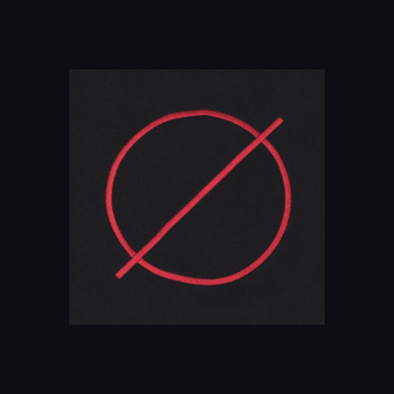
  </a>

  <h3 align="center">Milk Filter Mobile</h3>

  <p align="center">
    A pixel-art photo filter app for Android inspired by the visual style of <em>Milk inside a bag of milk and with support for the Milk filter made by LucaSinUnaS</em>.
    <br />
    <br />
    <a href="https://github.com/figurophobia/milk-filter-mobile/issues/new?labels=bug">Report Bug</a>
    &middot;
    <a href="https://github.com/figurophobia/milk-filter-mobile/issues/new?labels=enhancement">Request Feature</a>
  </p>
</div>

<details>
  <summary>Table of Contents</summary>
  <ol>
    <li>
      <a href="#about-the-project">About The Project</a>
      <ul>
        <li><a href="#built-with">Built With</a></li>
      </ul>
    </li>
    <li><a href="#download">Download</a></li>
    <li>
      <a href="#getting-started">Getting Started</a>
      <ul>
        <li><a href="#prerequisites">Prerequisites</a></li>
        <li><a href="#installation">Installation</a></li>
      </ul>
    </li>
    <li><a href="#usage">Usage</a></li>
    <li><a href="#controls">Controls</a></li>
    <li><a href="#roadmap">Roadmap</a></li>
    <li><a href="#contributing">Contributing</a></li>
    <li><a href="#license">License</a></li>
    <li><a href="#acknowledgments">Acknowledgments</a></li>
  </ol>
</details>

---

## About The Project

<div align="center">
  <table>
    <tr>
      <td align="center">
        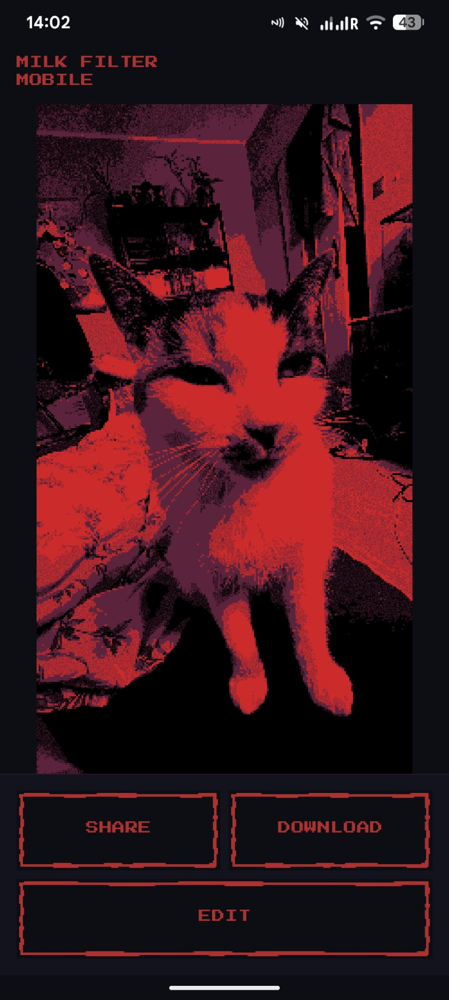<br/>
        <sub><b>Post-edit</b> — result ready to share or save</sub>
      </td>
      <td align="center">
        <br/>
        <sub><b>Milk filter</b> — flat palette, deep reds and purples</sub>
      </td>
      <td align="center">
        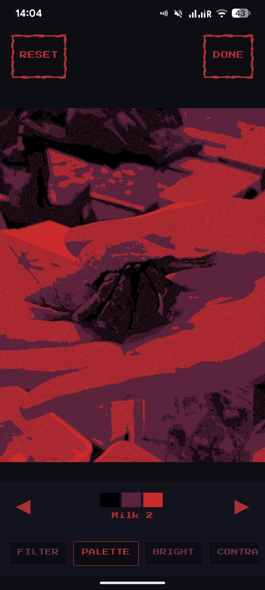<br/>
        <sub><b>Palette picker</b> — cycle through game-inspired palettes</sub>
      </td>
    </tr>
  </table>
</div>

<br/>

Milk Filter Mobile converts any photo into the distinctive visual aesthetic of Nikita Kryukov's *Milk* game series — with the palette of the first game and the second.

It includes two filter modes: the **Milk filter**, ported from [LucaSinUnaS/Milk-Filter](https://github.com/LucaSinUnaS/Milk-Filter), and the **Pixel Art filter**, an original dithering-based effect developed independently by Me.

A web version of both filters was also implemented by me — including video support — is also available at [Milk Filter Online](https://github.com/figurophobia/Milk-Filter-Online) ([live demo](https://figurophobia.github.io/Milk-Filter-Online/)).

Key highlights:
* Two filter modes: **Pixel Art** (original ordered dithering) and **Milk** (ported from LucaSinUnaS)
* Nine fully adjustable parameters with live preview
* Hand-picked color palettes drawn from the games' and a few original ones
* Export via share sheet or direct gallery download
* Pixel-art UI using [Press Start 2P](https://fonts.google.com/specimen/Press+Start+2P), a font visually close to the typeface used in the games

<p align="right">(<a href="#readme-top">back to top</a>)</p>

### Built With

* [![Kotlin][Kotlin-shield]][Kotlin-url]
* [![Android][Android-shield]][Android-url]
* [![Android Studio][AndroidStudio-shield]][AndroidStudio-url]
* [![Material Design][Material-shield]][Material-url]

<p align="right">(<a href="#readme-top">back to top</a>)</p>

---

## Download

Grab the ready-to-install Android APK — no build tools required:

<div align="center">
  <a href="https://github.com/figurophobia/Milk-Filter-Mobile/releases/download/v1.0.0/milk-filter-mobile-v1.0.0.apk">
    
  </a>
</div>

* **Direct download:** [milk-filter-mobile-v1.0.0.apk](https://github.com/figurophobia/Milk-Filter-Mobile/releases/download/v1.0.0/milk-filter-mobile-v1.0.0.apk)
* **All versions:** [Releases page](https://github.com/figurophobia/Milk-Filter-Mobile/releases)

> Requires Android 7.0 (API 24) or newer. On first install your device may ask you to allow *"Install from unknown sources"* for the browser or file manager you use to open the APK.

<p align="right">(<a href="#readme-top">back to top</a>)</p>

---

## Getting Started

### Prerequisites

* Android Studio Hedgehog or later
* Android SDK 34
* A device or emulator running Android 7.0 (API 24) or higher

### Installation

1. Clone the repo
   ```sh
   git clone https://github.com/figurophobia/milk-filter-mobile.git
   ```
2. Open the project in Android Studio
3. Let Gradle sync finish
4. Run on a device or emulator:
   ```sh
   ./gradlew assembleDebug
   ```
   The APK lands in `app/build/outputs/apk/debug/`

> **Or** install the debug APK directly onto your device via `adb install app/build/outputs/apk/debug/app-debug.apk`

<p align="right">(<a href="#readme-top">back to top</a>)</p>

---

## Usage

```
Pick photo  →  EDIT  →  adjust controls  →  DONE  →  SHARE / DOWNLOAD
```

1. Tap **+** on launch to pick a photo from your gallery
2. Tap **EDIT** to enter editing mode
3. Scroll the bottom toolbar to switch controls
4. Tap **DONE** to confirm, or **RESET** to undo the current filter pass
5. **SHARE** sends the result to any app · **DOWNLOAD** saves it to your gallery

> 🖼️ **To change the photo, just tap the middle of the image.** At any point — while previewing, and even on the final SHARE / DOWNLOAD screen — tapping the center of the preview reopens the picker so you can swap in a different photo (or video) without going back or restarting.

<div align="center">
  <table>
    <tr>
      <td align="center">
        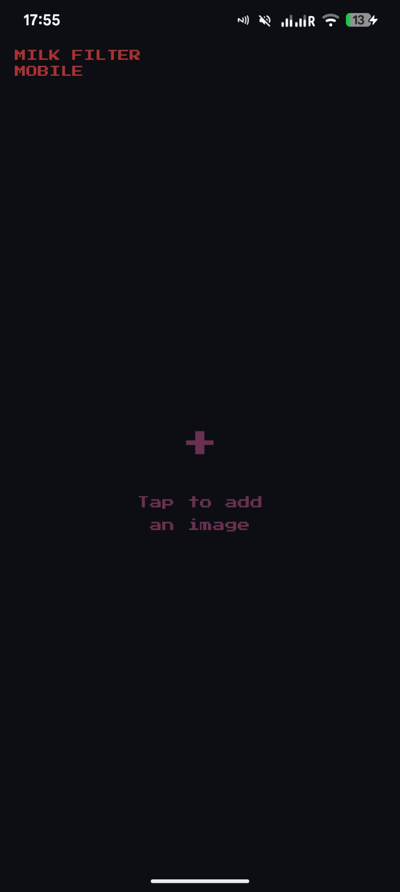<br/>
        <sub><b>Home screen</b> — tap anywhere to pick a photo</sub>
      </td>
      <td align="center">
        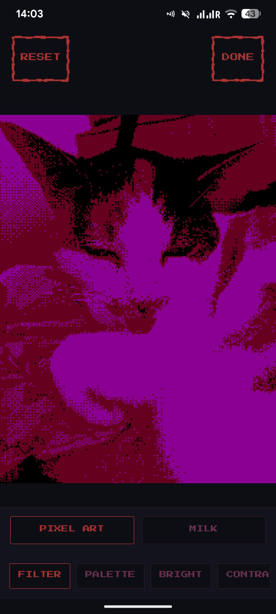<br/>
        <sub><b>Pixel Art mode</b> — ordered dithering applied</sub>
      </td>
      <td align="center">
        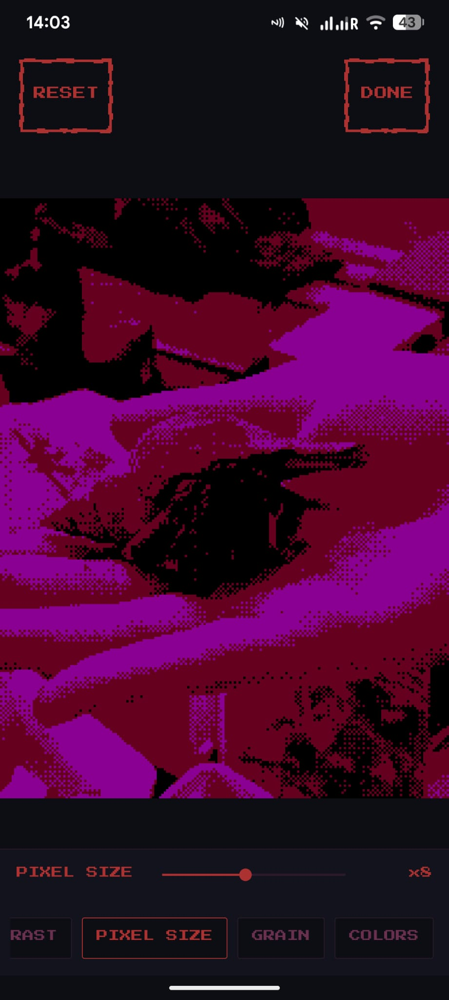<br/>
        <sub><b>Pixel Size</b> — mosaic block size from ×1 to ×20</sub>
      </td>
      <td align="center">
        <br/>
        <sub><b>Done</b> — share anywhere or save to gallery</sub>
      </td>
    </tr>
  </table>
</div>

<p align="right">(<a href="#readme-top">back to top</a>)</p>

---

## Controls

| Control | What it does |
|---|---|
| Filter | Switch between *Pixel Art* (dithered) and *Milk* (flat) |
| Palette | Cycle through color palettes with live preview |
| Brightness | Multiplier 0.1 – 3.0 |
| Contrast | Multiplier 0.1 – 3.0 |
| Pixel Size | Mosaic block size ×1 – ×20 |
| Grain | Noise intensity 0.0 – 3.0 |
| Colors | Palette quantization depth 2 – 32 |
| Pointillism | Dot-pattern overlay ON / OFF |
| Compression | JPEG quality 10 – 95 (lower = crunchier) |

<div align="center">
  <table>
    <tr>
      <td align="center">
        <br/>
        <sub><b>Filter</b> — Milk vs Pixel Art mode</sub>
      </td>
      <td align="center">
        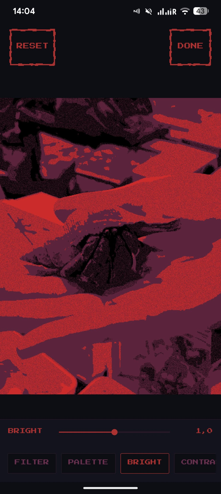<br/>
        <sub><b>Brightness</b> — light multiplier slider</sub>
      </td>
      <td align="center">
        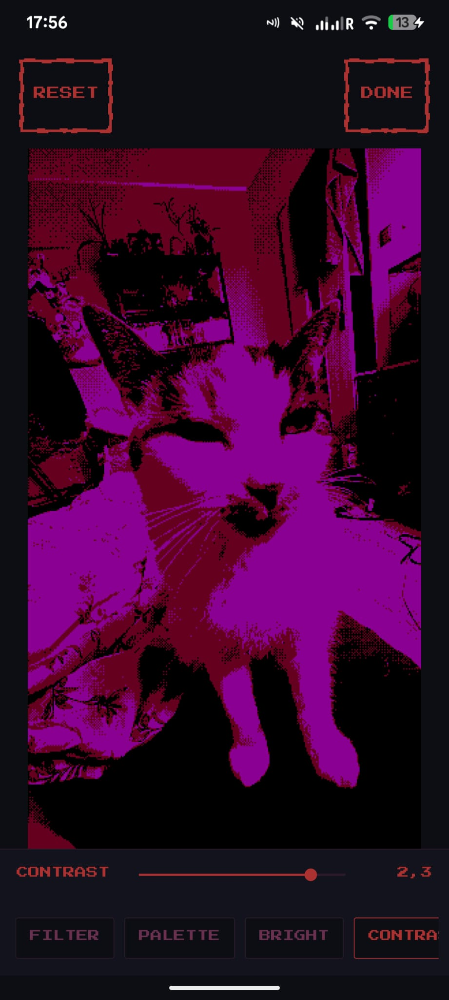<br/>
        <sub><b>Contrast</b> — pushes darks darker, lights lighter</sub>
      </td>
      <td align="center">
        <br/>
        <sub><b>Grain</b> — film noise intensity</sub>
      </td>
    </tr>
    <tr>
      <td align="center">
        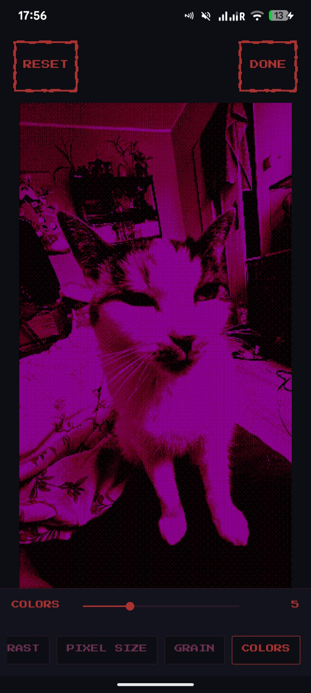<br/>
        <sub><b>Colors</b> — palette quantization depth</sub>
      </td>
      <td align="center">
        <br/>
        <sub><b>Pixel Size</b> — mosaic block multiplier</sub>
      </td>
      <td align="center">
        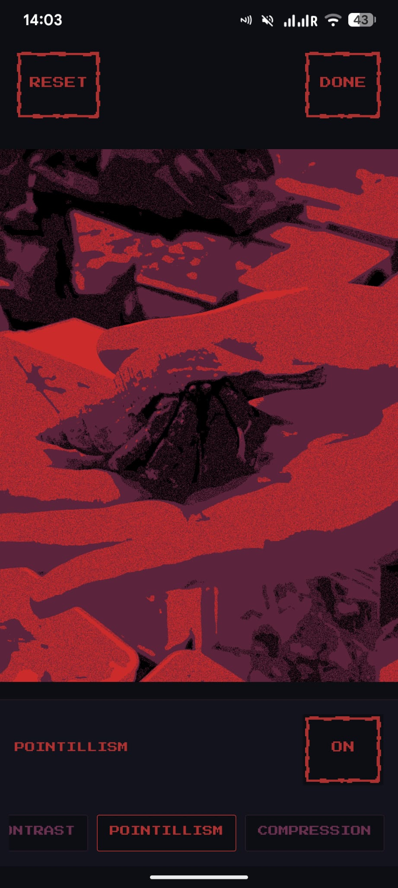<br/>
        <sub><b>Pointillism</b> — dot-pattern overlay toggle</sub>
      </td>
      <td align="center">
        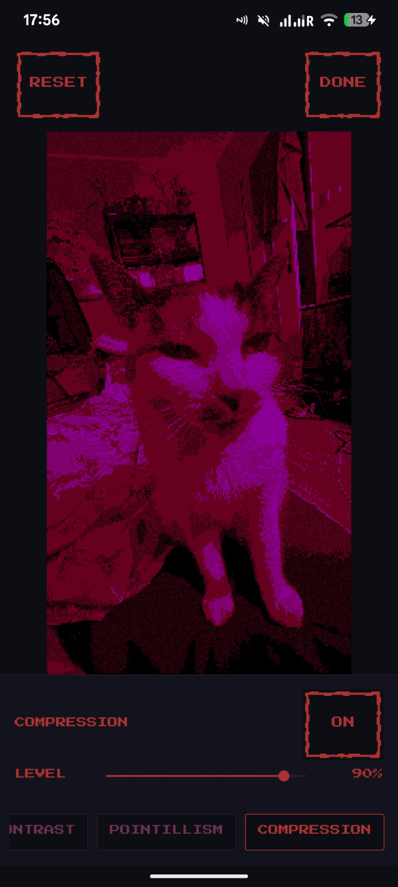<br/>
        <sub><b>Compression</b> — JPEG quality for extra lo-fi crunch</sub>
      </td>
    </tr>
  </table>
</div>

<p align="right">(<a href="#readme-top">back to top</a>)</p>

---

## Roadmap

- [x] Pixel Art filter (ordered dithering)
- [x] Milk filter (flat palette + grain)
- [x] Color palette selector
- [x] Brightness, contrast, grain, pixel size, colors, pointillism, compression controls
- [x] Share and download result
- [ ] Before / after split view
- [ ] Additional palettes
- [ ] Video support

See the [open issues](https://github.com/figurophobia/milk-filter-mobile/issues) for the full list of proposed features and known bugs.

<p align="right">(<a href="#readme-top">back to top</a>)</p>

---

## Contributing

Contributions are welcome and greatly appreciated.

1. Fork the project
2. Create your feature branch (`git checkout -b feature/AmazingFeature`)
3. Commit your changes (`git commit -m 'Add AmazingFeature'`)
4. Push to the branch (`git push origin feature/AmazingFeature`)
5. Open a Pull Request

<p align="right">(<a href="#readme-top">back to top</a>)</p>

---

## License

Distributed under the MIT License. See [`LICENSE`](LICENSE) for details.

<p align="right">(<a href="#readme-top">back to top</a>)</p>

---

## Acknowledgments

* **[Milk Filter](https://github.com/LucaSinUnaS/Milk-Filter)** by [LucaSinUnaS](https://github.com/LucaSinUnaS) — original Milk filter algorithm ported into this app
* **[Nikita Kryukov](https://nikita-kryukov.itch.io/)** — creator of the games whose visual style inspired the whole project:
  * [Milk inside a bag of milk inside a bag of milk](https://store.steampowered.com/app/1392820/)
  * [Milk outside a bag of milk outside a bag of milk](https://store.steampowered.com/app/1604000/)
* [Press Start 2P](https://fonts.google.com/specimen/Press+Start+2P) — pixel-art font visually close to the typeface used in the games

<p align="right">(<a href="#readme-top">back to top</a>)</p>

---

<div align="center">
  <p>If you enjoy the app and feel like it, you can buy me a coffee ☕</p>
  <a href="https://ko-fi.com/davidsanchezmiguez">
    
  </a>
</div>

---

[contributors-shield]: https://img.shields.io/github/contributors/figurophobia/milk-filter-mobile.svg?style=for-the-badge
[contributors-url]: https://github.com/figurophobia/milk-filter-mobile/graphs/contributors
[forks-shield]: https://img.shields.io/github/forks/figurophobia/milk-filter-mobile.svg?style=for-the-badge
[forks-url]: https://github.com/figurophobia/milk-filter-mobile/network/members
[stars-shield]: https://img.shields.io/github/stars/figurophobia/milk-filter-mobile.svg?style=for-the-badge
[stars-url]: https://github.com/figurophobia/milk-filter-mobile/stargazers
[issues-shield]: https://img.shields.io/github/issues/figurophobia/milk-filter-mobile.svg?style=for-the-badge
[issues-url]: https://github.com/figurophobia/milk-filter-mobile/issues
[downloads-shield]: https://img.shields.io/github/downloads/figurophobia/milk-filter-mobile/total.svg?style=for-the-badge
[downloads-url]: https://github.com/figurophobia/milk-filter-mobile/releases
[license-shield]: https://img.shields.io/github/license/figurophobia/milk-filter-mobile.svg?style=for-the-badge
[license-url]: https://github.com/figurophobia/milk-filter-mobile/blob/main/LICENSE
[Kotlin-shield]: https://img.shields.io/badge/Kotlin-7F52FF?style=for-the-badge&logo=kotlin&logoColor=white
[Kotlin-url]: https://kotlinlang.org/
[Android-shield]: https://img.shields.io/badge/Android-3DDC84?style=for-the-badge&logo=android&logoColor=white
[Android-url]: https://developer.android.com/
[AndroidStudio-shield]: https://img.shields.io/badge/Android%20Studio-3DDC84?style=for-the-badge&logo=androidstudio&logoColor=white
[AndroidStudio-url]: https://developer.android.com/studio
[Material-shield]: https://img.shields.io/badge/Material%20Design-757575?style=for-the-badge&logo=material-design&logoColor=white
[Material-url]: https://m3.material.io/

